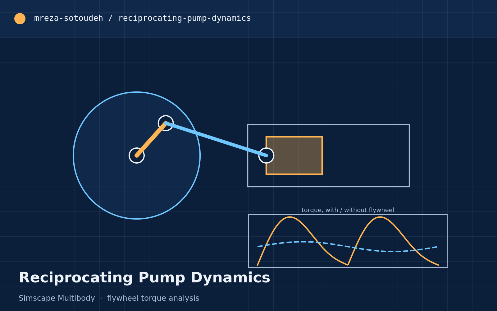
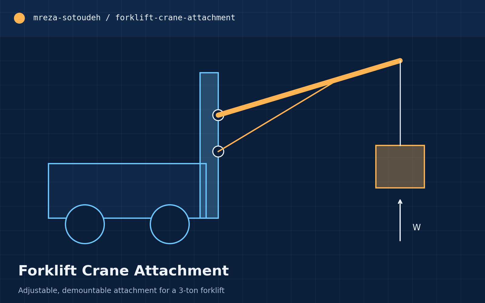
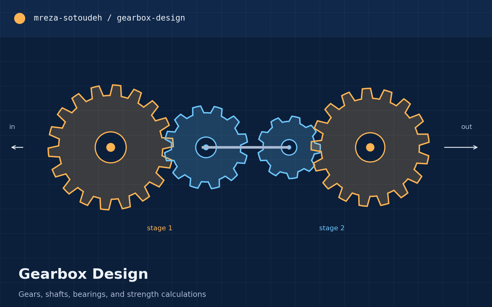

<!doctype html>
<html lang="en">
  <head>
    <meta charset="UTF-8" />
    <meta name="viewport" content="width=device-width, initial-scale=1.0" />
    <meta name="description" content="Ali Sakhaei — mechanical engineering student interested in robotics, control, simulation, embedded systems, and mechanical design." />
    <meta name="theme-color" content="#071017" />
    <title>Ali Sakhaei | Engineering Portfolio</title>
    <link rel="stylesheet" href="assets/styles.css" />
    
    
  </head>
  <body>
    <canvas id="robot-canvas" aria-hidden="true"></canvas>
    <button class="robot-motion" type="button" aria-pressed="false" aria-label="Pause background animation">Pause animation</button>
    <a class="skip-link" href="#main">Skip to content</a>

    <header class="site-header" id="top">
      <a class="brand" href="#home" aria-label="Ali Sakhaei, home">
        AS
        Ali Sakhaei
      </a>
      <button class="menu-button" type="button" aria-expanded="false" aria-controls="site-nav">
        
        Open navigation
      </button>
      <nav class="site-nav" id="site-nav" aria-label="Main navigation">
        <a href="#about">About</a>
        <a href="#focus">Focus</a>
        <a href="#projects">Projects</a>
        <a href="#contact">Contact</a>
      </nav>
    </header>

    <main id="main">
      <section class="hero" id="home" aria-labelledby="hero-title">
        

          
Mechanical Engineering · Robotics

          <h1 id="hero-title">Ali Sakhaei</h1>
          

            I work across mechanical design, control, simulation, and embedded systems, with a growing focus on designing and building robotic systems.
          

          

            <a class="button button-primary" href="#projects">View projects</a>
            <a class="button button-secondary" href="https://github.com/alisakhaei" target="_blank" rel="noreferrer">GitHub profile</a>
          

        

        

          

          

          

          
Current direction robotic systems that connect mechanics, sensing, and control

        

        <a class="scroll-cue" href="#about" aria-label="Scroll to About section">Scroll ↓</a>
      </section>

      <section class="section about" id="about" aria-labelledby="about-title">
        
01 About

        

          

            <h2 id="about-title">Engineering ideas from model to mechanism.</h2>
          

          

            

              I am a Mechanical Engineering student interested in robotics and the process of turning an idea into a working system. My academic work has included mechanical design, dynamic modeling, control, CFD, and physics-informed neural networks.
            

            

              I am especially interested in projects where CAD and mechanism design meet simulation, electronics, and embedded implementation. I am still exploring the exact robotics field I want to specialize in.
            

            

              
Education<strong>B.Sc. Mechanical Engineering</strong>

              
Languages<strong>Persian - English - German</strong>

            

          

        

      </section>

      <section class="section focus" id="focus" aria-labelledby="focus-title">
        
02 Focus areas

        

          <h2 id="focus-title">What I am learning and building around</h2>
          
A broad robotics direction supported by mechanical engineering fundamentals.

        

        

          <article>01<h3>Robotic Systems</h3>
Mechanisms and integrated systems designed to sense, move, and perform useful tasks.
</article>
          <article>02<h3>Control & Simulation</h3>
Dynamic modeling, controller design, and simulation of mechanical and electromechanical systems.
</article>
          <article>03<h3>Embedded & Electronics</h3>
Coursework and practical experience with electronics, sensors, and embedded implementation.
</article>
          <article>04<h3>Mechanical Design</h3>
CAD, machine elements, assemblies, engineering drawings, and design calculations.
</article>
          <article>05<h3>Computational Engineering</h3>
CFD, numerical analysis, and machine-learning methods applied to engineering problems.
</article>
        

        

          MATLABSimulinkSimscapePythonPyTorchSolidWorksANSYS FluentArduinoLaTeX
        

      </section>

      <section class="section projects" id="projects" aria-labelledby="projects-title">
        
03 Selected work

        

          <h2 id="projects-title">Projects</h2>
          
Academic work across design, dynamics, control, and computational engineering.

        

        

          <article class="project-card">
            <button class="project-open" type="button" data-project="pinn" aria-label="Open Airfoil Flow PINN project details">
              

              
01
Computational Methods
<h3>Airfoil Flow with PINNs</h3>
Potential-flow analysis and physics-informed neural networks for two-dimensional airfoil flow.

PythonPyTorchPINN
View details ↗

            </button>
          </article>

          <article class="project-card">
            <button class="project-open" type="button" data-project="pump" aria-label="Open Reciprocating Pump Dynamics project details">
              

              
02
Multibody Dynamics
<h3>Reciprocating Pump Dynamics</h3>
Multibody simulation of a pump mechanism, including operating-speed comparison and flywheel effects.

SimscapeDynamicsSimulation
View details ↗

            </button>
          </article>

          <article class="project-card">
            <button class="project-open" type="button" data-project="motor" aria-label="Open DC Motor Speed Control project details">
              

              
03
Control & Simulation
<h3>DC Motor Speed Control</h3>
Physics-based motor model, open-loop analysis, and PI speed control in MATLAB/Simulink.

MATLABSimulinkPI Control
View details ↗

            </button>
          </article>

          <article class="project-card">
            <button class="project-open" type="button" data-project="forklift" aria-label="Open Forklift Crane Attachment project details">
              

              
04
Mechanical Design
<h3>Forklift Crane Attachment</h3>
Adjustable crane attachment with structural calculations, joint design, drawings, and a complete SolidWorks assembly.

SolidWorksMachine DesignStructural Analysis
View details ↗

            </button>
          </article>

          <article class="project-card">
            <button class="project-open" type="button" data-project="gearbox" aria-label="Open Gearbox Design project details">
              

              
05
Machine Design
<h3>Two-Stage Gearbox</h3>
Mechanical design and analysis of gears, shafts, bearings, housing, and the complete assembly.

SolidWorksGearsMachine Elements
View details ↗

            </button>
          </article>

          <article class="project-card">
            <button class="project-open" type="button" data-project="fluent" aria-label="Open ANSYS Fluent Flow Analysis project details">
              

              
06
CFD
<h3>ANSYS Fluent Flow Analysis</h3>
Numerical flow studies of a diffuser, pipe elbow, and compressible nozzle with post-processing in MATLAB.

ANSYS FluentMATLABCFD
View details ↗

            </button>
          </article>
        

      </section>

      <section class="section contact" id="contact" aria-labelledby="contact-title">
        

          
04 Contact

          <h2 id="contact-title">Interested in engineering and robotics projects.</h2>
          
For project, research, and collaboration inquiries, connect with me by email, LinkedIn, or GitHub.

        

        

          <a href="mailto:ali.skhei20@gmail.com">Email<strong>ali.skhei20@gmail.com</strong><b>↗</b></a>
          <a href="https://www.linkedin.com/in/a-sakhaei" target="_blank" rel="noreferrer">LinkedIn<strong>linkedin.com/in/a-sakhaei</strong><b>↗</b></a>
          <a href="https://github.com/alisakhaei" target="_blank" rel="noreferrer">GitHub<strong>github.com/alisakhaei</strong><b>↗</b></a>
        

      </section>
    </main>

    <footer>Ali SakhaeiEngineering portfolio · <a href="#top">Back to top ↑</a></footer>

    <dialog class="project-dialog" id="project-dialog">
      <button class="dialog-close" type="button" aria-label="Close project details">×</button>
      

      <h2 id="dialog-title"></h2>
      

      

      <a class="button button-primary" id="dialog-link" href="#" target="_blank" rel="noreferrer">View repository ↗</a>
    </dialog>
  </body>
</html>
